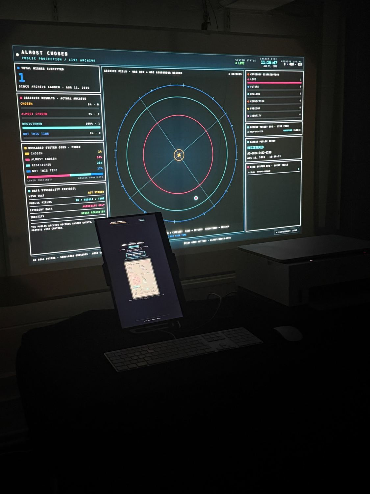
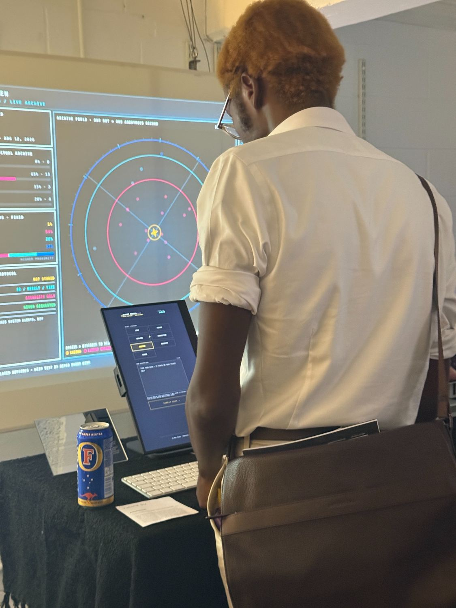
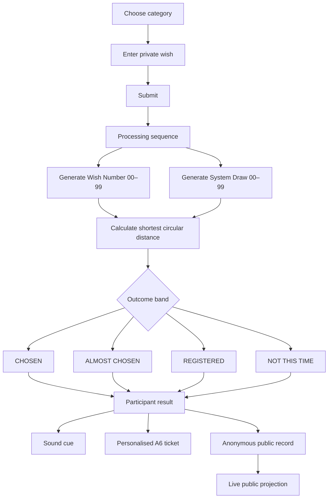
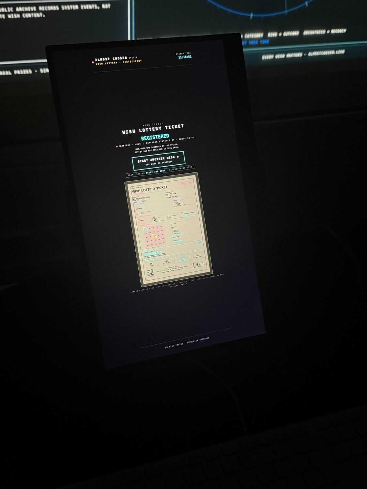
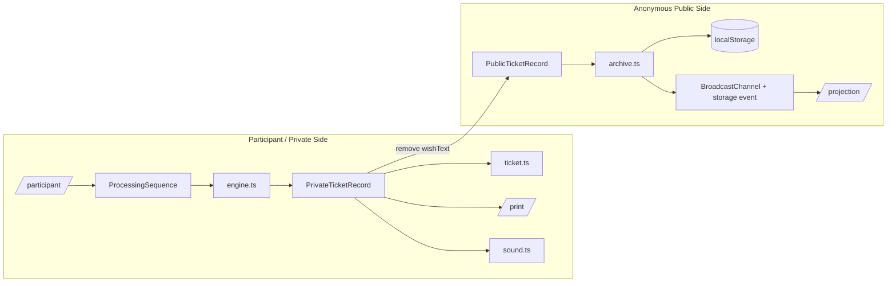
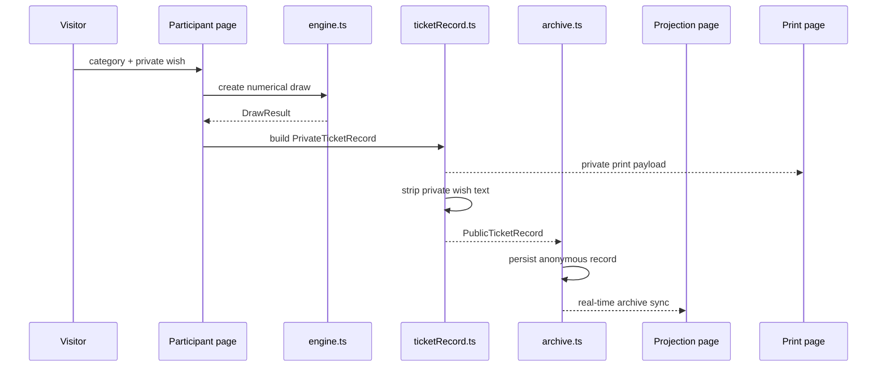
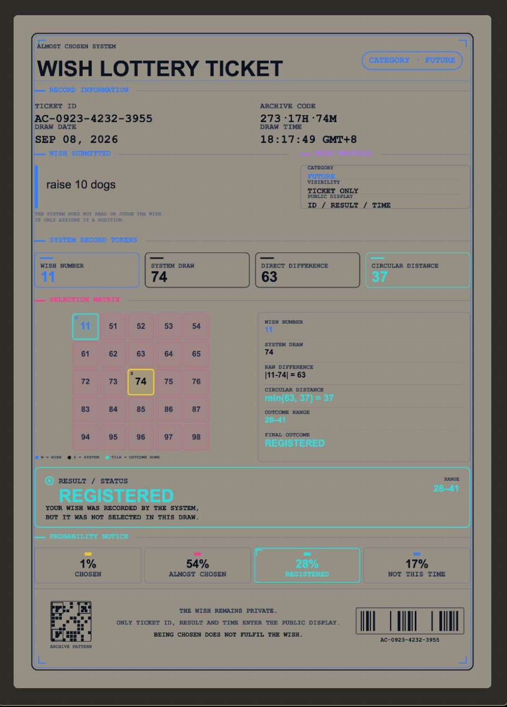
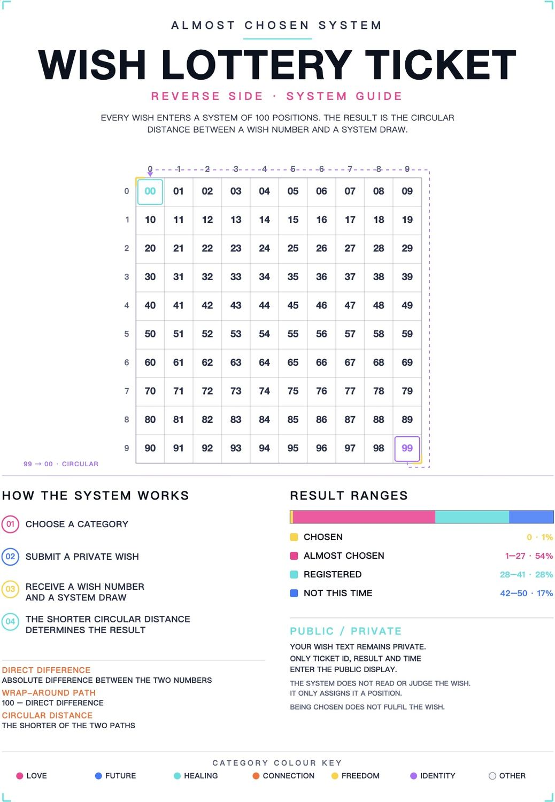
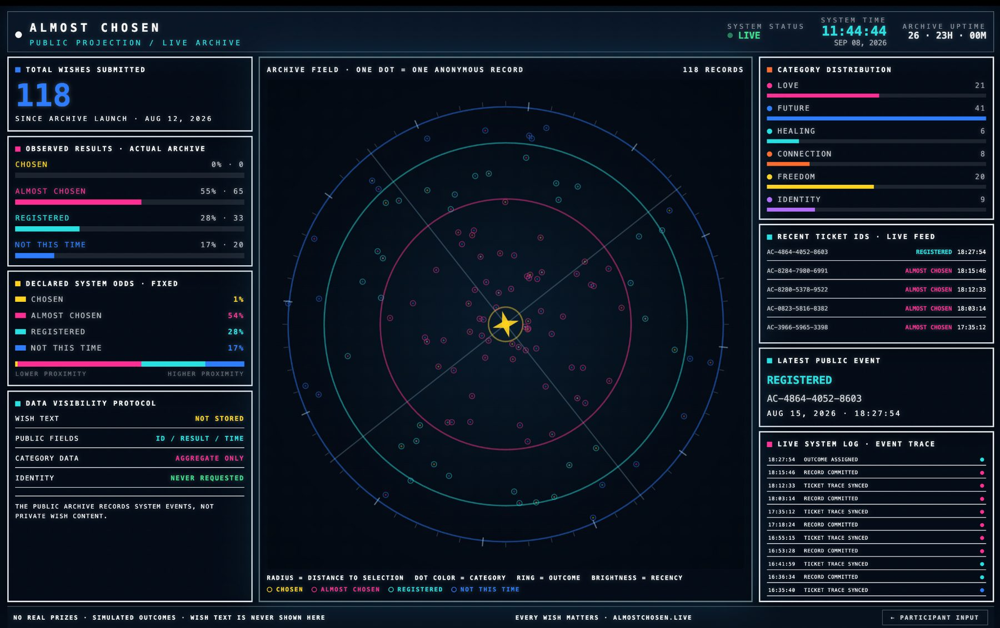

# ALMOST CHOSEN

**An interactive wish-lottery installation that transforms private wishes into probabilistic outcomes, printed tickets and an anonymous public archive.**

**Yutong Du · MA Computational Arts · 2026**

Video documentation: https://vimeo.com/1225091032?share=copy&fl=sv&fe=ci

<p align="center">
  
</p>

## Overview

**Almost Chosen** is an interactive wish-lottery installation exploring chance, waiting and the desire to be selected.

A participant chooses a category, enters a private wish and submits it to the system. The system assigns a **Wish Number** from `00–99`, generates an independent **System Draw**, and calculates the shortest circular distance between those two positions. The distance produces one of four outcomes: **CHOSEN**, **ALMOST CHOSEN**, **REGISTERED**, or **NOT THIS TIME**.

The same result then drives several outputs at once:

- the participant-facing result screen;
- the sound cue;
- a personalised A6 ticket;
- an anonymous record on the live public projection.

The wish itself stays within the participant / print context. It is not included in the public archive.

---

## Concept and Motivation

The project began from two experiences that felt structurally similar to me: buying lottery tickets with friends for fun, and waiting for university application results.

In both situations, something is submitted and then control is surrendered. Rationally, I know that a lottery win is unlikely and that an application decision is outside my control once it has been sent. Emotionally, however, the waiting period can still produce a strong sense of anticipation: *maybe this time I will be selected*.

The title **Almost Chosen** comes from this suspended state of being close to selection without fully reaching it. Earlier versions of the project used terms such as **WAITLISTED** and later **ARCHIVED**. The final term **REGISTERED** was chosen because it describes an interaction entering the system without suggesting that the participant's private wish becomes part of a public archive.

A key artistic reference was **Ghost of a Dream**, the collaborative practice of Lauren Was and Adam Eckstrom. Their use of discarded lottery tickets as traces of hope and imagined futures influenced my decision to make the ticket a central physical object rather than simply a receipt. The project also relates to participatory and chance-based works including Yoko Ono's *Wish Tree*, Christian Boltanski's *Chance*, Rivane Neuenschwander's *I Wish Your Wish*, and Rafael Lozano-Hemmer's *Pulse Room*.

<p align="center">
  
</p>

---

## Interaction Flow

The participant interaction is deliberately simple. The system becomes more complex only after submission.



The participant chooses one of seven categories:

`LOVE · FUTURE · HEALING · CONNECTION · FREEDOM · IDENTITY · OTHER`

After submission, the interface moves through a staged processing sequence before revealing the result. The visible delay is part of the interaction: it gives the numerical procedure time to feel like a draw rather than an instant form response.

<p align="center">
  
</p>

---

## Probability System

The numerical system treats `00–99` as a ring rather than a straight line. This means the distance between `99` and `00` is `1`, not `99`.

The calculation is:

```text
directDifference = |wishNumber - systemDraw|
wrapAround       = 100 - directDifference
circularDistance = min(directDifference, wrapAround)
```

For example:

```text
Wish Number        11
System Draw        74
Direct Difference  63
Wrap-Around        37
Circular Distance  37
Outcome             REGISTERED
```

The final distance bands are:

| Circular distance | Outcome | Declared probability |
|---:|---|---:|
| `0` | **CHOSEN** | **1%** |
| `1–27` | **ALMOST CHOSEN** | **54%** |
| `28–41` | **REGISTERED** | **28%** |
| `42–50` | **NOT THIS TIME** | **17%** |

These percentages come directly from the number of circular positions in each band. Because distance `1–27` can occur on either side of the selected position, it covers `54` of the `100` possible relative positions.

### Shared probability engine

The core calculation is centralised in `src/lib/engine.ts`. The same configuration is used by the participant interface, ticket, projection, archive statistics and result colour system. This prevents different parts of the installation from displaying different probability rules.

The circular-distance function is implemented as:

```ts
export function circularDistance(a: number, b: number): number {
  const direct = Math.abs(a - b) % 100;
  return Math.min(direct, 100 - direct);
}
```

The outcome bands are also stored as one shared configuration:

```ts
export const OUTCOME_BANDS = [
  { outcome: 'CHOSEN', minDistance: 0,  maxDistance: 0,  percent: 1  },
  { outcome: 'ALMOST CHOSEN', minDistance: 1,  maxDistance: 27, percent: 54 },
  { outcome: 'REGISTERED', minDistance: 28, maxDistance: 41, percent: 28 },
  { outcome: 'NOT THIS TIME', minDistance: 42, maxDistance: 50, percent: 17 },
];
```

---

## System Architecture

The installation runs as several browser views from one React/Vite application. The participant screen and public projection are separate routes but share the same local archive and numerical system.



### Data path



---

## Private / Public Data Separation

Privacy is not only a visual promise in the interface; it is reflected in the record structure used by the code.

`ticketRecord.ts` defines two different payloads.

### Private ticket record

Used only for the participant result and print context. It can contain:

- ticket ID;
- category;
- result;
- Wish Number;
- System Draw;
- direct difference;
- wrap-around distance;
- circular distance;
- outcome range;
- timestamp;
- **wish text**.

### Public ticket record

Used by the archive and projection. It contains:

- ticket ID;
- category;
- result;
- Wish Number;
- System Draw;
- circular distance;
- timestamp.

It intentionally contains **no `wishText` field**.

`archive.ts` persists the anonymous archive using `localStorage`. Real-time communication between the participant and projection pages uses `BroadcastChannel`, with the browser `storage` event as a secondary cross-tab synchronisation path.

Admin test records can be marked with `isTest` and are excluded from normal public statistics unless explicitly included during testing.

---

## Physical Ticket

The ticket is designed as an A6 physical record of the interaction.

The **personalised front** contains the submitted wish, ticket ID, category, Wish Number, System Draw, direct difference, circular distance, outcome range and result. The **reverse side** is a fixed system guide explaining the `00–99` circular field, result ranges, category colours and public/private data rules.

To extend chance beyond the numerical result, the physical paper was also variable. During the exhibition, each ticket was printed on a randomly selected sheet from a mixture of different colours and paper textures. This meant that two participants could receive the same outcome but still leave with materially different objects.

<table>
<tr>
<td width="50%" align="center"></td>
<td width="50%" align="center"></td>
</tr>
<tr>
<td align="center"><em>Personalised front</em></td>
<td align="center"><em>Fixed reverse-side system guide</em></td>
</tr>
</table>

### Print structure

The front and reverse are handled separately:

- `/back-preprint` renders the fixed reverse so sheets can be prepared in advance;
- `/print` renders the personalised front for the current interaction;
- `ticket.ts` generates the personalised ticket graphics;
- `ticketBack.ts` renders the reverse-side guide;
- `ticketRecord.ts` stores A6 dimensions and print calibration values.

The A6 print geometry is defined as `105 × 148 mm`, with a 300 dpi reference canvas of approximately `1240 × 1748 px`.

The physical exhibition used an **HP Smart Tank 672**. The exhibition version automatically sent each interaction to the printer. This repository is a standalone browser archival version, so a normal browser may still show the operating-system print dialog. The code keeps a documented integration bridge for a local desktop wrapper if silent printing is needed again.

---

## Public Projection / Live Archive

The projection is not a second copy of the participant interface. It presents the accumulated system rather than the private wish.

It displays:

- total submitted interactions;
- observed outcome counts and percentages;
- declared system probabilities;
- category distribution;
- recent ticket IDs;
- the latest public event;
- a live event trace;
- one anonymous point for each archive record.

The central radial field visualises the archive spatially. Radius corresponds to distance from selection, while colour identifies outcome/category information according to the system palette.

<p align="center">
  
</p>

---

## Sound System

Sound is generated procedurally with the **Web Audio API** rather than external audio files.

`src/lib/sound.ts` contains the event-specific sound system for:

- submission;
- the multi-stage processing sequence;
- CHOSEN;
- ALMOST CHOSEN;
- REGISTERED;
- NOT THIS TIME.

The processing sound is designed as one continuous sequence that follows the visual processing stages. Result cues use different relative levels so CHOSEN is the strongest event, while the more common outcomes are quieter. Audio unlocks on the participant's first user gesture, which follows browser audio restrictions.

---

## Application Views

React Router separates the system into dedicated views:

| Route | Purpose |
|---|---|
| `/` | Participant view |
| `/participant` | Main participant interaction, processing and result |
| `/projection` | Anonymous public projection / live archive |
| `/print` | Personalised A6 ticket front |
| `/back-preprint` | Fixed A6 reverse-side guide |
| `/admin` | Testing, archive and calibration controls |

This separation was useful during installation because the participant display and projector could remain open as independent browser windows while still sharing the same local archive.

---

## Code Map

The repository is organised around a small number of project-specific modules rather than one large page file.

| File | Role |
|---|---|
| `src/App.tsx` | Route definitions for participant, projection, print, reverse and admin views |
| `src/pages/Participant.tsx` | Category/wish input, production interaction and final participant result |
| `src/components/ProcessingSequence.tsx` | Staged visual processing sequence before result reveal |
| `src/pages/Projection.tsx` | Live public archive and data visualisation |
| `src/pages/Print.tsx` | Print-only personalised ticket view |
| `src/pages/BackPreprint.tsx` | Fixed reverse-side A6 guide |
| `src/pages/Admin.tsx` | Testing and technical controls |
| `src/components/AdminPanel.tsx` | Admin control interface |
| `src/lib/engine.ts` | Categories, outcome bands, random draw logic and circular-distance calculation |
| `src/lib/archive.ts` | Anonymous record persistence, statistics and cross-page synchronisation |
| `src/lib/ticketRecord.ts` | Private/public payload separation, A6 geometry and print bridge |
| `src/lib/ticket.ts` | Personalised front-ticket rendering |
| `src/lib/ticketBack.ts` | Reverse-side system guide rendering |
| `src/lib/sound.ts` | Procedural Web Audio sound design |

### Project structure

```text
ALMOST-CHOSEN/
├── docs/
│   └── images/
├── public/
├── src/
│   ├── components/
│   │   ├── AdminPanel.tsx
│   │   └── ProcessingSequence.tsx
│   ├── hooks/
│   ├── lib/
│   │   ├── adminConfig.ts
│   │   ├── archive.ts
│   │   ├── engine.ts
│   │   ├── sound.ts
│   │   ├── ticket.ts
│   │   ├── ticketBack.ts
│   │   └── ticketRecord.ts
│   ├── pages/
│   │   ├── Admin.tsx
│   │   ├── BackPreprint.tsx
│   │   ├── Participant.tsx
│   │   ├── Print.tsx
│   │   └── Projection.tsx
│   ├── App.tsx
│   ├── index.css
│   └── main.tsx
├── INSTALL_ONCE.command
├── RUN_LOCAL.command
├── RUN_EXHIBITION.command
├── package.json
├── vite.config.ts
└── README.md
```

---

## Exhibition Setup

The final installation ran from one MacBook Air and used:

- **MacBook Air** — main computer;
- **15.6-inch display in portrait orientation** — participant interface;
- **projector** — public archive projection;
- **HP Smart Tank 672** — A6 ticket printer;
- **MacBook speakers** — system audio.

The MacBook drove both browser views, the printing workflow and sound system. The participant display was physically positioned in front of the projection so the visitor encountered a small private interface within a much larger public data field.

---

## Exhibition Outcome

The final exhibition recorded **118 interactions**.

| Result | Count | Observed | Declared |
|---|---:|---:|---:|
| CHOSEN | 0 | 0% | 1% |
| ALMOST CHOSEN | 65 | 55% | 54% |
| REGISTERED | 33 | 28% | 28% |
| NOT THIS TIME | 20 | 17% | 17% |

No visitor received **CHOSEN**, even though the 1% outcome remained genuinely available. The other observed results were close to the declared system probabilities.

Audience behaviour became part of the project for me. Most participants spent time reading the physical ticket and kept it afterwards. Several people returned to the system and submitted another wish because they wanted to receive the rare CHOSEN result. This repeated participation directly reflected the tension that motivated the work: understanding that a result is generated by chance does not necessarily prevent emotional investment in it.

The main technical limitation during exhibition was print speed. Automatic printing worked, but the inkjet delay created a pause between the digital result and receiving the physical object. A future installation could either use faster hardware or intentionally redesign that waiting period as part of the experience.

---

## Visual Development

The visual language changed substantially through prototyping.

Early versions borrowed more directly from colourful lottery and game interfaces. As the numerical mechanism became more central, the final system moved toward a darker and more computational visual language: grids, data fields, ticket IDs, system timestamps, numerical traces and a limited set of saturated accent colours.

The final design keeps the emotional content of the wish on one side and the impersonal system on the other. The system never attempts to interpret whether a wish is good, realistic or meaningful; it only assigns numbers and measures distance.

---

## Tech Stack

- React 18
- TypeScript
- Vite
- React Router
- p5.js
- Tailwind CSS
- Web Audio API
- BroadcastChannel API
- Web Storage / `localStorage`
- Browser print APIs

No server or external database is required for the standalone exhibition version. The archive lives in the local browser used by the installation.

---

## Setup and Run

### Requirements

- Node.js
- Corepack
- pnpm

### First-time installation

```bash
corepack enable
pnpm install --no-frozen-lockfile
```

### Run locally

```bash
pnpm dev
```

Then open:

```text
http://localhost:3000/participant
http://localhost:3000/projection
```

Keep both pages on the same local origin so they can share the archive and synchronise in real time.

### macOS helper scripts

The repository also includes:

```text
INSTALL_ONCE.command
RUN_LOCAL.command
RUN_EXHIBITION.command
```

`INSTALL_ONCE.command` installs dependencies. `RUN_LOCAL.command` starts the Vite development server. `RUN_EXHIBITION.command` builds and launches the production preview workflow.

### Production preview

```bash
pnpm build
pnpm preview
```

---

## Future Development

I am interested in continuing **Almost Chosen** as an online version that can extend beyond a single physical exhibition.

A longer-running archive would make it possible to observe how participants respond to the four outcomes over a much larger number of draws. One possible direction is a pseudonymous personal archive showing a participant's previous draws and number of returns without collecting a real-world identity or publishing the content of their wishes.

I would also like to collect optional feedback about how people interpret the result and whether repeated attempts change their emotional response to the system.

---

## References

### Artistic / Conceptual

- Ghost of a Dream (Lauren Was and Adam Eckstrom), *Dream Home* (2009)  
  https://www.young-masters.co.uk/first-edition-2009-winners
- Yoko Ono, *Wish Tree*  
  https://www.guggenheim-bilbao.eus/en/the-collection/works/wish-tree-for-bilbao
- Christian Boltanski, *Chance* (2011)  
  https://fondschristianboltanski.com/en/oeuvres/chance/
- Rivane Neuenschwander, *I Wish Your Wish* (2003)  
  https://archive.newmuseum.org/exhibitions/1056
- Rafael Lozano-Hemmer, *Pulse Room* (2006)  
  https://www.lozano-hemmer.com/pulse_room.php

### Theory

- Clark, L., Lawrence, A.J., Astley-Jones, F. and Gray, N. (2009). *Gambling near-misses enhance motivation to gamble and recruit win-related brain circuitry*. Neuron, 61(3), 481–490.  
  https://doi.org/10.1016/j.neuron.2008.12.031
- Kahneman, D. and Tversky, A. (1979). *Prospect Theory: An Analysis of Decision under Risk*. Econometrica, 47(2), 263–292.  
  https://doi.org/10.2307/1914185
- Langer, E.J. (1975). *The Illusion of Control*. Journal of Personality and Social Psychology, 32(2), 311–328.  
  https://doi.org/10.1037/0022-3514.32.2.311
- Wilson, T.D., Centerbar, D.B., Kermer, D.A. and Gilbert, D.T. (2005). *The Pleasures of Uncertainty: Prolonging Positive Moods in Ways People Do Not Anticipate*. Journal of Personality and Social Psychology, 88(1), 5–21.  
  https://doi.org/10.1037/0022-3514.88.1.5

### Technical

- MDN, `Math.random()`  
  https://developer.mozilla.org/en-US/docs/Web/JavaScript/Reference/Global_Objects/Math/random
- p5.js, `createGraphics()`  
  https://p5js.org/reference/p5/createGraphics/
- p5.js, `createCanvas()`  
  https://p5js.org/reference/p5/createCanvas/
- MDN, `localStorage`  
  https://developer.mozilla.org/en-US/docs/Web/API/Window/localStorage
- MDN, `BroadcastChannel`  
  https://developer.mozilla.org/en-US/docs/Web/API/BroadcastChannel
- MDN, Web Audio API  
  https://developer.mozilla.org/en-US/docs/Web/API/Web_Audio_API

The full bibliography is also included in the submitted final documentation PDF.

---

## AI-Assisted Development

Atoms was used as an AI-assisted development environment during the prototyping and implementation of the web interface. ChatGPT was used for technical troubleshooting, debugging, workflow support and language editing. AI-generated outputs were reviewed, adapted and tested throughout development.

- Atoms: https://atoms.dev/
- OpenAI ChatGPT: https://chatgpt.com/

---

## Author

**Yutong Du**  
MA Computational Arts · 2026
